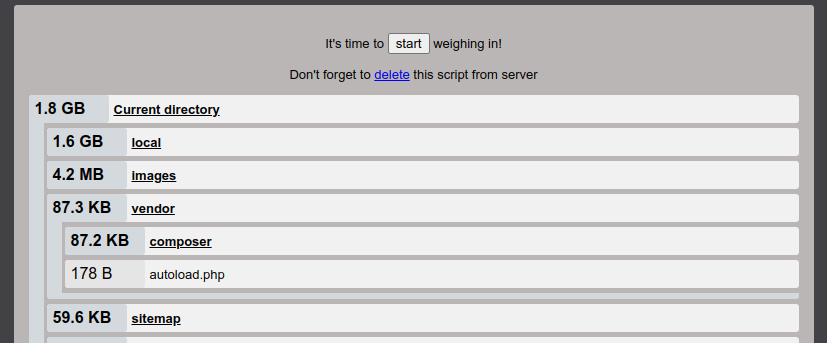

# Weigher.php
Простой инструмент анализа использования дискового пространства на PHP сайтах, размещенных на сервере. Предназначен для веб-мастеров.

  

Позволяет сгенерировать список с размерами папок и файлов в них, относительно корня сайта. Список сортируется по размеру, от самого крупного файла. Пустые файлы не учитываются и не выводятся в списке.

Поддерживает работу в PHP от 5.4 до 8.3 и новее.

## 🚀 Запуск
Файл weigher.php загружается в корень сайта, через FTP, SSH или панель хостинга. В браузере вводится ссылка к файлу на сайте в виде https://*адрес сайта*/weigher.php?run (вместо "run" можно сохранить в скрипте собственное кодовое слово для запуска)

## 🔎 Анализ
После открытия ссылки на скрипт в браузере, нажмите кнопку "start". По окончанию анализа, откроется страница с результатами и сообщением ниже "Weighing completed". Содержимое папок доступно для просмотра с помощью клика по ее названию. Если анализ продолжится более 50 секунд, он прервется с ошибкой "Weighing time has expired!". Это означает, что сайт слишком крупный для анализа скриптом, и необходимо уточнить размер сайта на стороне хостинга.

## 🛡️ Защиты от запуска посторонними лицами
GET параметр ?run необходим для запуска скрипта. Название данного параметра можно переименовать в скрипте, для усиления защиты, константа - "STARTER". Данная мера была добавлена еще и для защиты от индексации файла поисковыми роботами.

Скрипт необходимо удалять с сайта сразу, как только завершите процедуру анализа, во избежание запуска посторонними лицами. Если скрипт размещен на сервере более суток назад, скрипт перестанет запускаться из браузера. Необходимо будет загрузить скрипт на сервер заново.
